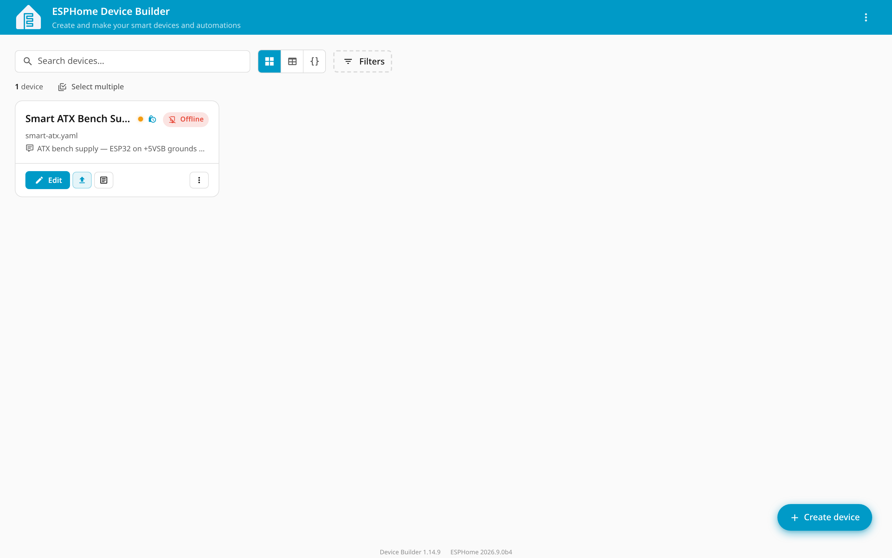
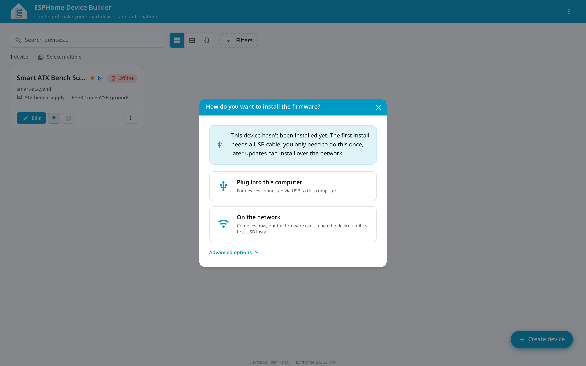
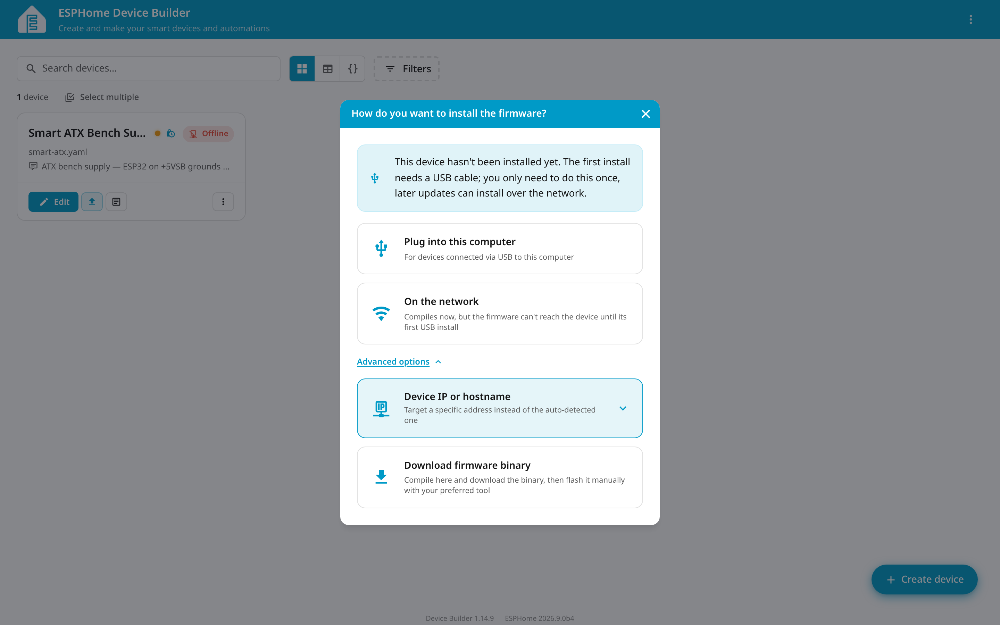
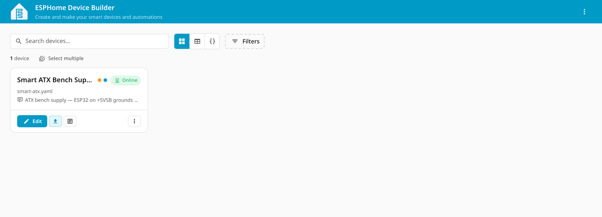
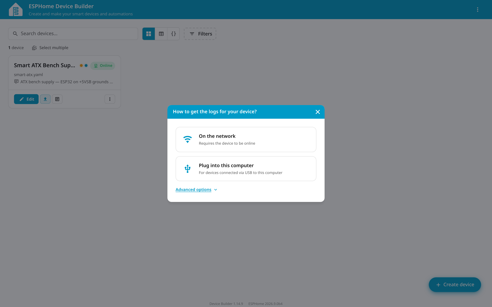
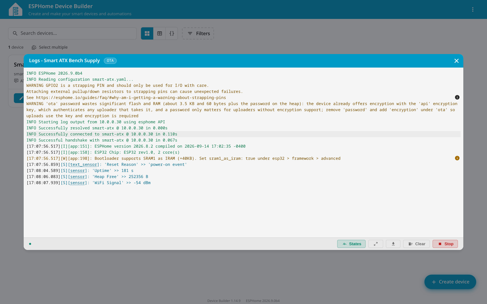

# Flashing the Smart ATX with ESPHome Device Builder — a walkthrough

A step-by-step record of flashing this project onto an ESP32 DEVKIT V1, with the screens
you'll actually see. Everything here was done on the hardware; the screenshots are of the
real session, not mockups.

**Starting point.** You have this repo, ESPHome installed (see
[the setup guide](setup-and-flash-guide.md)), your real values in `secrets.yaml`, and the
ESP32 connected by USB.

> **Unplug the ATX supply from mains before connecting USB.** On most ESP32 devkits `VIN`
> and USB `VBUS` meet at the regulator input with no isolation diode, so a live supply ties
> your computer's 5 V rail to `+5VSB`.

---

## Step 1 — Install the Device Builder

The web dashboard used to ship inside ESPHome. It doesn't any more — running
`esphome dashboard` now just tells you so:

```console
$ esphome dashboard
ERROR The built-in dashboard has been removed from ESPHome. Install and run ESPHome Device Builder instead:
  pip install esphome-device-builder
  esphome-device-builder
```

Install it as its own tool:

```bash
uv tool install --python 3.14 'esphome-device-builder[esphome]'
```

### Pitfall: the `[esphome]` extra is not optional

Install it without the extra and it starts, then immediately fails:

```console
$ esphome-device-builder
ERROR Running esphome-device-builder needs the 'esphome' package; reinstall with the [esphome] extra: pip install 'esphome-device-builder[esphome]'
```

`uv tool install` (and `pipx`) give every tool its own isolated virtualenv. The Device
Builder's venv can't see the `esphome` you installed earlier — that lives in a different
venv. The extra puts a copy inside its own environment. A plain `pip install` into a shared
environment would never have hit this.

Quote the brackets. `zsh` and some `bash` setups treat them as a glob.

---

## Step 2 — Start it, pointed at the right directory

```bash
cd ~/Multiverse/esp-light
esphome-device-builder --host 127.0.0.1 .
```

Two arguments that matter:

**The trailing `.`** — the Device Builder defaults its config directory to **`./configs`**.
Run it with no argument from this repo and it will create an empty `configs/` folder, find
nothing, and show you a first-run "Add new device" screen while `smart-atx.yaml` sits
ignored one level up. The `.` points it at the current directory.

**`--host 127.0.0.1`** — by default it binds `0.0.0.0`, and it runs **without
authentication**. Its own startup log says so:

```
WARNING: Dashboard is running WITHOUT AUTHENTICATION.
Anyone with network access to 0.0.0.0:6052 can manage your devices.
Set $ESPHOME_USERNAME / $ESPHOME_PASSWORD env vars to enable.
```

Anyone on your LAN could flash firmware to your devices. Bind it to loopback, or set
`ESPHOME_USERNAME` / `ESPHOME_PASSWORD`. Note that the remote-build peer-link port (6055)
binds to all interfaces regardless.

You should see it find the config:

```
INFO Devices controller started — 1 devices loaded
INFO Device Builder ready — config dir: .
```

Open **<http://localhost:6052>**.

---

## Step 3 — The dashboard, before anything is flashed



The card shows the device name from `esphome.friendly_name`, the filename, the `comment:`
line from the config, and an **Offline** badge — correct, since nothing has been flashed to
the board yet. Offline here means "not reachable on the network," not "not plugged in."

---

## Step 4 — The install dialog

Click the **Install** button (the upload arrow on the card).



ESPHome explains the situation itself: *"This device hasn't been installed yet. The first
install needs a USB cable; you only need to do this once, later updates can install over
the network."*

- **Plug into this computer** — flashes over USB from your browser, using Web Serial.
- **On the network** — compiles now, but can't reach a device that has never been flashed.

**Advanced options** holds two more:



- **Device IP or hostname** — target a specific address instead of the auto-detected one.
- **Download firmware binary** — compile here, flash it yourself with another tool. This is
  what you'd use to carry a `.bin` to <https://web.esphome.io/> on another machine.

### What is *not* here

There's no "flash from the computer running the Device Builder" option. Even though the
Device Builder is running on the same machine the ESP32 is plugged into, the USB path goes
**through your browser** via Web Serial — not through the server.

That has a practical consequence: Web Serial needs a real browser with a native port
chooser. It works in Chrome and Edge on the desktop; it does not exist in Firefox or Safari,
or on iOS. And it only works in a *secure context*, which is why this option is unavailable
on a Home Assistant instance served over plain `http://` — and why `localhost` works here.

---

## Step 5 — Flash

Click **Plug into this computer**, pick your serial port in the browser's chooser, and let
it run.

If you would rather not use the browser at all, the CLI does the same job:

```console
$ esphome run smart-atx.yaml --device /dev/ttyUSB0
...
Wrote 949216 bytes (620456 compressed) at 0x00000000 in 14.7 seconds (516.2 kbit/s).
Verifying written data...
Hash of data verified.

Hard resetting via RTS pin...
INFO Successfully uploaded program.
```

Eighteen seconds, start to finish, on an already-warm build cache.

### Pitfall: `esphome upload` does not recompile

This one cost real time. `esphome upload` flashes **the last binary that was built** — it
does not rebuild from your YAML. Flash with it after editing `secrets.yaml` and you'll
happily write a stale image, then watch the device fail to join a network:

```
[W][wifi_esp32:865]: Disconnected ssid='validation-only' reason='Probe Request Unsuccessful'
[W][wifi:1723]: Network no longer found
```

That SSID was a placeholder from days earlier, baked into a binary built before the real
credentials existed. Use **`esphome run`**, which compiles *then* uploads. If you do want
them separate, run `esphome compile` first and check the config hash changes.

You can confirm which secrets are in a binary before flashing it:

```bash
grep -a -c "your-old-ssid" .esphome/build/smart-atx/build/smart-atx.bin
```

---

## Step 6 — Watch it boot

Reset the board and you should see it come up and join your network:

```
I (27) boot: ESP-IDF v5.5.5 2nd stage bootloader
[I][app:151]: ESPHome version 2026.8.2 compiled on 2026-09-14 17:02:35 -0400
[I][app:158]: ESP32 Chip: ESP32 rev1.0, 2 core(s)
[I][wifi:1469]: - '<YOUR-SSID>' (<BSSID>) ▂▄▆█
[I][wifi:1128]: Connecting to '<YOUR-SSID>' ... (attempt 1/2 in phase SCAN_CONNECTING)...
[I][wifi:1609]: Connected
[W][component:313]: wifi cleared Warning flag
```

Full transcript: [`logs/04-first-boot.log`](logs/04-first-boot.log).

If `esphome logs` shows nothing, you probably attached after the device had already settled.
ESPHome is quiet at `INFO` level once it's running. Press the board's reset button to get a
fresh boot.

Confirm it's really on the network:

```console
$ getent hosts smart-atx.local
10.0.0.30       smart-atx.local
```

---

## Step 7 — Online



The badge flips to **Online** once the Device Builder can reach the device's API.

---

## Step 8 — Live logs

Click the **Logs** button on the card. You're offered two routes:



**On the network** streams over the ESPHome API and is handled server-side, so it works in
any browser — no Web Serial needed.



This is the shot worth keeping. Everything the config promised is visible and working:

```
INFO Successfully connected to smart-atx @ 10.0.0.30 in 0.110s
[17:07:56.517][I][app:151]: ESPHome version 2026.8.2 compiled on 2026-09-14 17:02:35
[17:07:56.517][I][app:158]: ESP32 Chip: ESP32 rev1.0, 2 core(s)
[17:07:56.859][S][text_sensor]: 'Reset Reason' >> 'power-on event'
[17:08:04.589][S][sensor]: 'Uptime' >> 181 s
[17:08:06.083][S][sensor]: 'Heap Free' >> 252356 B
[17:08:07.939][S][sensor]: 'WiFi Signal' >> -54 dBm
```

All four diagnostic entities reporting, and `Reset Reason` confirming a clean power-on.

---

## The two warnings you'll see

### `GPIO2 is a strapping PIN`

Expected, and left un-silenced on purpose. GPIO2 drives the onboard LED. It *is* a strapping
pin, but it's only sampled at boot, and on this board the LED sits between the pin and
ground so it cannot hold the pin high at the wrong moment. `ignore_strapping_warning: true`
would hide it — but if you adapt this config to a board whose LED is wired to 3.3 V instead,
that warning is one you want to see.

### `'ota' password wastes significant flash and RAM`

This one is more interesting, because **it only appears in the Device Builder, not in the
CLI.**

The Device Builder bundles its own ESPHome, and it's running a *different version* to the
one the CLI uses:

| | |
|---|---|
| `esphome` CLI | 2026.8.2 (stable) |
| Device Builder's bundled copy | 2026.9.0b4 (beta) |

Its suggested fix — replace `ota.password` with `ota.encryption`, reusing the API key — is
real, but the `encryption:` option **does not exist in 2026.8.2**. The component's config
schema has no such key; adopting the advice would fail to validate on the stable release.

So the advice is filed, not applied. This config keeps `ota.password` until 2026.9.0 is
stable.

It's a good illustration of why this project treats the CLI as the source of truth and the
Device Builder as a viewer: a beta toolchain will happily give you guidance your actual
build can't act on.

---

## It writes to your git repository

Worth knowing before you point it at a repo you care about: the Device Builder has a
**version history** feature, and it implements it by making real git commits in your working
tree. Its startup log mentions this in passing:

```
INFO Version history active (git work tree: /home/miswired/Multiverse/esp-light)
```

Edit a config while it's running — from the browser *or* from your editor — and a commit
appears, authored by the tool:

```console
$ git log --oneline -2
ca5da70 Add the Device Builder walkthrough with screenshots
be53193 Edit smart-atx.yaml

$ git show --format="author: %an <%ae>" be53193 | head -1
author: ESPHome Device Builder <device-builder@esphome.io>
```

It's a reasonable feature and a genuine safety net if you're editing YAML in a browser with
no version control of your own. But it has consequences:

- Generic commit messages (`Edit smart-atx.yaml`) interleave with your own structured
  history.
- It commits whatever changed, so a config with inline credentials rather than `!secret`
  references would be committed too. (In this repo, `secrets.yaml` is gitignored and has
  never been committed by anything.)
- Commits appear without you asking, including for edits you made in a different editor.

To turn it off, set `version_history_enabled` to `false` in
`.device-builder-preferences.json` in your config directory:

```json
{
  "version_history_enabled": false
}
```

The tool also drops `.device-builder.json`, `.device-builder-preferences.json`, and
`.device-builder-peer-link-key.bin` into the config directory, and adds a `.device-builder*`
rule to `.git/info/exclude` so they stay untracked.

## What the GUI is good for

Honestly: the dashboard, the config editor, and the network log viewer. The flashing itself
is one CLI command that works in every browser-free context, needs no secure origin, and
doesn't depend on Web Serial support.

```bash
esphome run smart-atx.yaml
```

The Device Builder earns its place when you want to read logs comfortably, edit YAML in a
browser, or manage several devices at once.
